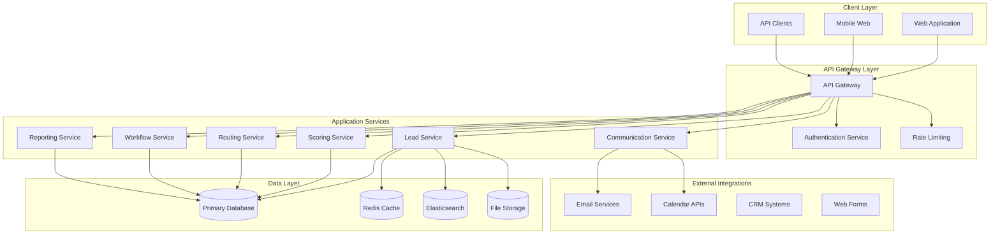

# Lead Management System Design Document

## Overview

The Lead Management System is designed as a modern, scalable web application that centralizes lead processing from multiple channels. The system follows a microservices architecture pattern with clear separation of concerns, supporting both real-time operations and batch processing workflows. The design emphasizes data integrity, automation capabilities, and user experience optimization for both Thai and English-speaking users.

## Architecture

### High-Level Architecture

The system follows a layered architecture with the following components:



### Technology Stack

- **Frontend**: React.js with TypeScript, Material-UI for components, React Query for state management
- **Backend**: Node.js with Express.js, TypeScript for type safety
- **Database**: PostgreSQL for primary data, Redis for caching and session management
- **Search**: Elasticsearch for full-text search and analytics
- **File Storage**: AWS S3 or compatible object storage
- **Message Queue**: Redis Pub/Sub for real-time notifications, Bull Queue for background jobs
- **Authentication**: JWT tokens with refresh token rotation
- **API Documentation**: OpenAPI 3.0 with Swagger UI

## Components and Interfaces

### Core Services

#### Lead Service
Handles all lead-related operations including CRUD operations, data validation, and duplicate detection.

**Key Interfaces:**
```typescript
interface LeadService {
  createLead(leadData: CreateLeadRequest): Promise<Lead>
  updateLead(leadId: string, updates: UpdateLeadRequest): Promise<Lead>
  getLead(leadId: string): Promise<Lead>
  searchLeads(criteria: SearchCriteria): Promise<PaginatedLeads>
  detectDuplicates(leadData: LeadData): Promise<DuplicateMatch[]>
  mergeLead(sourceId: string, targetId: string): Promise<Lead>
  convertLead(leadId: string, conversionData: ConversionRequest): Promise<ConversionResult>
}
```

#### Scoring Service
Manages lead scoring algorithms and score calculations.

**Key Interfaces:**
```typescript
interface ScoringService {
  calculateScore(leadId: string): Promise<LeadScore>
  updateScoringModel(modelId: string, criteria: ScoringCriteria): Promise<ScoringModel>
  recalculateAllScores(modelId: string): Promise<BatchResult>
  getScoreBands(): Promise<ScoreBand[]>
}
```

#### Routing Service
Handles lead assignment and distribution logic.

**Key Interfaces:**
```typescript
interface RoutingService {
  assignLead(leadId: string): Promise<Assignment>
  createAssignmentRule(rule: AssignmentRule): Promise<AssignmentRule>
  reassignLead(leadId: string, newAssignee: string, reason: string): Promise<Assignment>
  checkSLACompliance(leadId: string): Promise<SLAStatus>
}
```

#### Communication Service
Manages all communication channels and templates.

**Key Interfaces:**
```typescript
interface CommunicationService {
  sendEmail(templateId: string, leadId: string, variables: Record<string, any>): Promise<EmailResult>
  processInboundEmail(emailData: InboundEmail): Promise<ProcessingResult>
  createTemplate(template: EmailTemplate): Promise<EmailTemplate>
  scheduleFollowUp(leadId: string, followUpData: FollowUpRequest): Promise<Task>
}
```

#### Workflow Service
Handles automation workflows and business process execution.

**Key Interfaces:**
```typescript
interface WorkflowService {
  executeWorkflow(workflowId: string, context: WorkflowContext): Promise<WorkflowResult>
  createWorkflow(workflow: WorkflowDefinition): Promise<Workflow>
  scheduleWorkflow(workflowId: string, schedule: Schedule): Promise<ScheduledWorkflow>
}
```

### Frontend Components

#### Lead Management Interface
- **LeadForm**: Comprehensive form for lead creation and editing
- **LeadList**: Paginated list view with filtering and sorting
- **LeadKanban**: Drag-and-drop Kanban board for status management
- **LeadDetail**: Detailed view with activity timeline and communication history

#### Dashboard Components
- **MetricsDashboard**: Key performance indicators and conversion metrics
- **ReportBuilder**: Interactive report creation and scheduling
- **ActivityFeed**: Real-time activity stream across all leads

## Data Models

### Core Entities

#### Lead Entity
```typescript
interface Lead {
  id: string
  accountLeadId: string // Auto-generated format: AL-YY-MM-XXX
  company: {
    id?: string
    name: string
    industry?: string
    size?: CompanySize
  }
  contact: {
    name: string
    phone?: string
    mobile?: string
    email: string
  }
  source: {
    channel: LeadChannel
    campaign?: string
    utmParams?: UTMParameters
  }
  assignment: {
    assignedTo?: string
    assignedAt?: Date
    assignmentReason?: string
  }
  status: LeadStatus
  score: {
    value: number
    band: ScoreBand
    lastCalculated: Date
  }
  qualification: {
    interest?: InterestLevel
    budget?: BudgetStatus
    timeline?: PurchaseTimeline
    businessType?: BusinessType
  }
  followUp: {
    nextDate?: Date
    notes?: string
  }
  product: {
    type?: ProductType
    adType?: AdType
  }
  metadata: {
    createdAt: Date
    updatedAt: Date
    createdBy: string
    isActive: boolean
  }
  customFields: Record<string, any>
}
```

#### Task Entity
```typescript
interface Task {
  id: string
  leadId: string
  subject: string
  description?: string
  type: TaskType
  priority: Priority
  assignedTo: string
  dueDate: Date
  status: TaskStatus
  reminders: Reminder[]
  createdAt: Date
  completedAt?: Date
}
```

#### Activity Entity
```typescript
interface Activity {
  id: string
  leadId: string
  type: ActivityType
  subject: string
  details: Record<string, any>
  performedBy: string
  performedAt: Date
  relatedEntities?: RelatedEntity[]
}
```

#### Assignment Rule Entity
```typescript
interface AssignmentRule {
  id: string
  name: string
  priority: number
  conditions: RuleCondition[]
  actions: RuleAction[]
  isActive: boolean
  workingHours?: WorkingHours
  territories?: Territory[]
}
```

### Database Schema Design

The system uses PostgreSQL with the following key design principles:
- Normalized schema with appropriate foreign key relationships
- Audit trails for all critical entities
- Soft deletes for data retention
- Indexing strategy optimized for common query patterns
- Partitioning for large tables (activities, audit logs)

## Error Handling

### Error Classification
1. **Validation Errors**: Input validation failures, business rule violations
2. **System Errors**: Database connectivity, external service failures
3. **Authorization Errors**: Permission denied, invalid tokens
4. **Business Logic Errors**: Duplicate detection, workflow violations

### Error Response Format
```typescript
interface ErrorResponse {
  error: {
    code: string
    message: string
    details?: Record<string, any>
    timestamp: string
    requestId: string
  }
}
```

### Error Handling Strategy
- Graceful degradation for non-critical features
- Retry mechanisms for transient failures
- Circuit breaker pattern for external service calls
- Comprehensive logging with correlation IDs
- User-friendly error messages with actionable guidance

## Testing Strategy

### Unit Testing
- Jest for JavaScript/TypeScript testing
- 90%+ code coverage requirement
- Mock external dependencies
- Test business logic in isolation

### Integration Testing
- API endpoint testing with supertest
- Database integration tests with test containers
- External service integration tests with mock servers

### End-to-End Testing
- Playwright for browser automation
- Critical user journey testing
- Cross-browser compatibility testing
- Mobile responsiveness testing

### Performance Testing
- Load testing with Artillery.js
- Database query performance monitoring
- API response time benchmarking
- Memory leak detection

### Security Testing
- OWASP ZAP for vulnerability scanning
- SQL injection prevention testing
- XSS protection validation
- Authentication and authorization testing

## Security Considerations

### Data Protection
- AES-256 encryption for data at rest
- TLS 1.3 for data in transit
- Field-level encryption for sensitive data (PII)
- Secure file upload with virus scanning

### Access Control
- Role-based access control (RBAC)
- Principle of least privilege
- Multi-factor authentication support
- Session management with secure tokens

### Audit and Compliance
- Comprehensive audit logging
- GDPR compliance features (data export, deletion)
- Data retention policies
- Consent management

## Performance and Scalability

### Caching Strategy
- Redis for session data and frequently accessed entities
- Application-level caching for scoring models and assignment rules
- CDN for static assets and file downloads

### Database Optimization
- Read replicas for reporting queries
- Connection pooling and query optimization
- Automated backup and point-in-time recovery
- Database monitoring and alerting

### Horizontal Scaling
- Stateless application design
- Load balancer configuration
- Auto-scaling based on metrics
- Database sharding strategy for future growth

## Monitoring and Observability

### Application Monitoring
- APM with New Relic or DataDog
- Custom metrics for business KPIs
- Real-time alerting for critical issues
- Performance dashboards

### Logging Strategy
- Structured logging with correlation IDs
- Centralized log aggregation
- Log retention policies
- Security event monitoring

### Health Checks
- Application health endpoints
- Database connectivity checks
- External service dependency monitoring
- Automated failover procedures